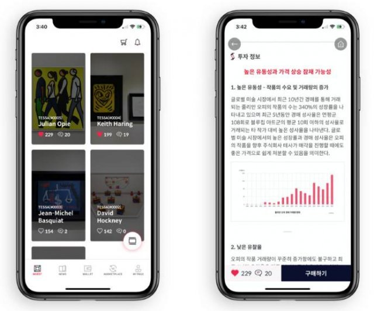

# 예술품 시장에서의 NFT 적용사례

## NFT 적용사례

### "테사(TESSA)" 미술품 소유권 NFT로 구매&#x20;


테사는 고가의 미술 작품 소유권을 여러 명이 나눠 투자하고 서로 판매할 수 있도록 돕는다. 수십, 수백명이 하나의 작품을 분할 소유하기 때문에 억대가 넘는 작품도 부담없이 소액으로 투자하고 구매할 수 있다.


#### 테사의 수익구조


수익구분에 따라 즉시, 월별, 분기별, 매각시 본인 명의 계좌를 등록하여 언제들 입출금이 가능하다.


1. 작품 렌탈 및 라이센운용 수익
2. 작품 매각 수익(분할 소유권 비율 51% 이상 찬성시에만 매각)
3. 개인간 소유권 P2P 거

### 1만 조각으로 나뉘어 NFT로 판매되는 뱅크시의 작품


2005년 작 ‘사랑은 공중에’, 조각당 약 176만원에 판매&#x20;

“그림의 이미지 아닌 그림의 소유권 개념 파는 것”


.webp>)

판매되는 작품은 뱅크시의 2005년 작인 ‘사랑은 공중에(Love is in the Air)’로 한 남성이 폭탄을 투척하는 것 같은 자세로 폭탄 대신 꽃다발을 손에 들고 있는 회화 작품이다.

크리스티 경매 출신 루익 고저가 설립한 벤처기업 파티클은 지난 5월 이 작품을 1290만 달러(약 151억 원)에 사들였는데, 작품을 가로 세로 각 100개로 나누어 총 1만 개의 고유한 사각형 조각을 만들고, 각 조각에 해당하는 NFT를 1500달러(약 176만원) 가량에 판매하였다.
